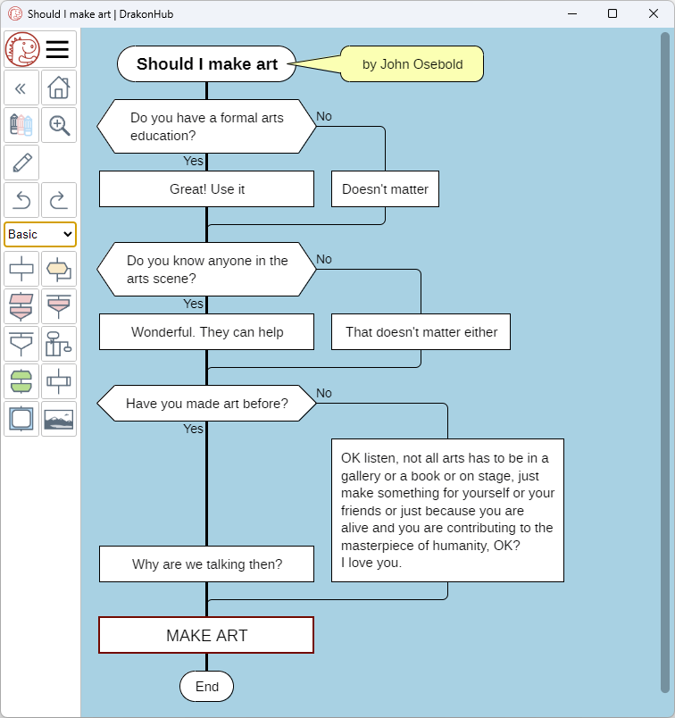

# DrakonHub for desktop

The desktop version of the DrakonHub diagram editor

DrakonHub for desktop is based on [DrakonWidget library](https://github.com/stepan-mitkin/drakonwidget)

## What is DrakonHub for desktop

DrakonHub for Desktop is a diagram editor that supports three types of diagrams.

- Drakon-charts, flowcharts from the aerospace industry that visualize algorithms.
- Mind-maps.
- Free-form diagrams.

DrakonHub runs on Windows and Linux.

## What is DRAKON

DRAKON is a visual language for presenting algorithms. DRAKON is similar to flowcharts. The strong point of the DRAKON language is the rules that make it easier to read diagrams.

## Why DrakonHub

DrakonHub takes care of the routine:

- Several actions in one click
- Automatic alignment of objects
- Copy elements without breaking the diagram

## Download DrakonHub

Download DrakonHub from [GitHub releases](https://github.com/stepan-mitkin/drakonhub_desktop/releases)
