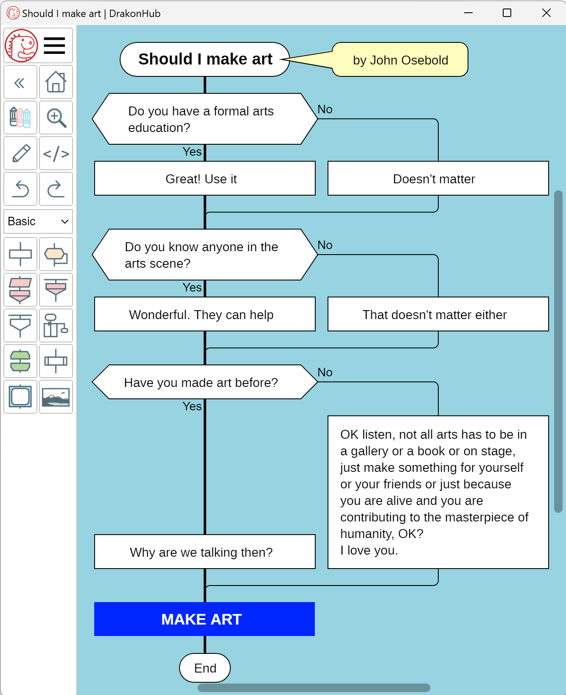

# DrakonHub

DrakonHub is diagram editor for Desktop, Mobile, and Browser

DrakonHub supports three types of diagrams.

- Drakon-charts, flowcharts from the aerospace industry that visualize algorithms.
- Mind-maps.
- Free-form diagrams.

DrakonHub for desktop is based on [DrakonWidget library](https://github.com/stepan-mitkin/drakonwidget)

[DrakonHub's homepage](https://drakonhub.com/)

## Download DrakonHub

- [Download DrakonHub from GitHub releases](https://github.com/stepan-mitkin/drakonhub_desktop/releases)

## Download DrakonHub for phones and tablets

## Run this app in the browser without downloading

- [Run DrakonHub in the browser](https://stepan-mitkin.github.io/drakonhub_desktop/drakonhub)

The app does **not** send your diagrams or documents over the internet.
All your data stays on this device.

## What is DRAKON

DRAKON is a visual language for presenting algorithms. DRAKON is similar to flowcharts. The strong point of the DRAKON language is the rules that make it easier to read diagrams.

## Why DrakonHub

DrakonHub takes care of the routine:

- Several actions in one click
- Automatic alignment of objects
- Copy elements without breaking the diagram

## Example diagrams

- [Drakon examples](https://drakonhub.com/en/drakon-on-simple-examples)
- [Mind-map examples](https://drakonhub.com/en/mind-map-in-simple-examples)
